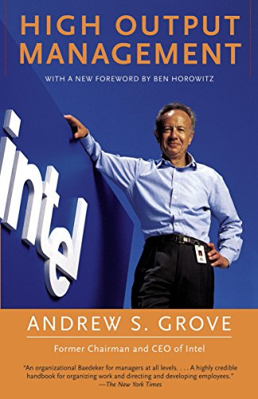
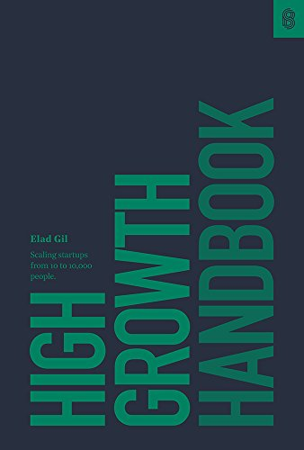

### Bookshelf - find your next favorite book 

In this repository you’ll find a list of book summaries and notes I’ve taken on some of my favorite books. You'll also find lists of book recommendations, and my thoughts on specific big ideas gleaned from various books.

*Please read [contribution guidelines](CONTRIBUTING.md) before contributing 💜*

  

# Newsletter

If you're a tech founder, inspiring entrepreneur or indie maker subscribe to my weekly newsletter and receive insights and hand-curated tips directly in your inbox 📨

# Book Summaries

| Cover                                                                             | Name                                                                                                                                       | Author            | Summary                         |
| --------------------------------------------------------------------------------- | ------------------------------------------------------------------------------------------------------------------------------------------ | ----------------- | ------------------------------- |
|                                 | [Sapiens: A Brief History of Humankind](https://www.amazon.com/Sapiens-Humankind-Yuval-Noah-Harari/dp/0062316095)                          | Yuval Noah Harari | [Read more](books/sapiens.md) ➡️ | 4.9/5 |
|                           | [Atomic Habits](https://www.amazon.com/Atomic-Habits-Proven-Build-Break/dp/0735211299)                                                     | James Clear       | [Read more](books/sapiens.md) ➡️ |
|                                  | [Rework](https://www.amazon.com/Rework-Jason-Fried/dp/0307463745)                                                                          | Jason Fried       | [Read more](books/sapiens.md) ➡️ |
|                                  | [Remote](https://www.amazon.com/Remote-Office-Required-Jason-Fried/dp/0091954673)                                                         | Jason Fried       | [Read more](books/sapiens.md) ➡️ |
|                                 | [Shape up](https://basecamp.com/shapeup)                                                       | Ryan Singer      | [Read more](books/sapiens.md) ➡️ |
|  | [How to Win Friends & Influence People](https://www.amazon.com/How-Win-Friends-Influence-People/dp/0671027034)                         | Dale Carnegie       | [Read more](books/sapiens.md) ➡️ |
|                  | [High Output Management](https://www.amazon.com/High-Output-Management-Andrew-Grove/dp/0679762884)                                         | Andrew Grove       | [Read more](books/sapiens.md) ➡️ |
|               | [The Making of a Manager: What to Do When Everyone Looks to You](https://www.amazon.com/Making-Manager-What-Everyone-Looks/dp/0735219567) | Julie Zhuo       | [Read more](books/sapiens.md) ➡️ |
|     | [Confessions of an Unintentional CTO](https://www.goodreads.com/book/show/35442625-confessions-of-an-unintentional-cto)                            | Jack Kinsella       | [Read more](books/sapiens.md) ➡️ |
|       | [The Hard Thing About Hard Things](https://www.amazon.com/Hard-Thing-About-Things-Building/dp/0062273205)                               | Ben Horowitz       | [Read more](books/sapiens.md) ➡️ |
|                       | [Art of Leadership: Small Things, Done Well](https://www.amazon.com/Art-Leadership-Small-Things-Done/dp/1492045691)                     | Michael Lopp       | [Read more](books/sapiens.md) ➡️ |
|                          | [Elegant Puzzle: Systems of Engineering Management](https://www.amazon.com/Elegant-Puzzle-Systems-Engineering-Management/dp/1732265186)              | Will Larson       | [Read more](books/sapiens.md) ➡️ |
|                    | [High Growth Handbook](https://www.amazon.com/High-Growth-Handbook/dp/1732265100)                                       | Elad Gil       | [Read more](books/sapiens.md) ➡️ |
|                            | [The Mom Test](https://www.amazon.com/Mom-Test-customers-business-everyone/dp/1492180742)                                                   | Rob Fitzpatrick       | [Read more](books/sapiens.md) ➡️ |