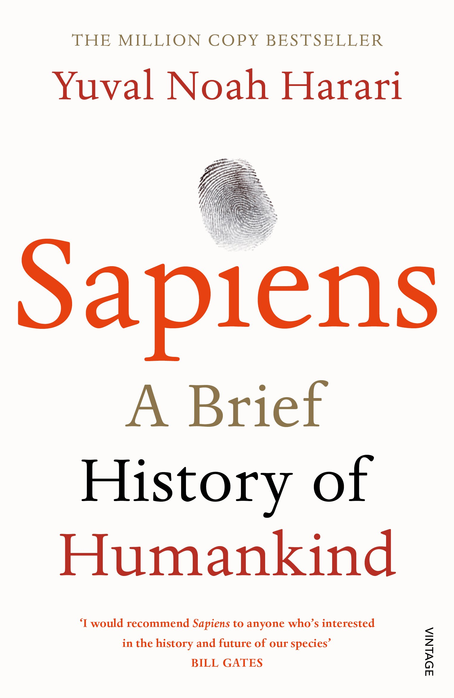

### Bookshelf - find your next favorite book 

 

# Newsletter

Receive new blogs, book announcements and curated reading lists directly in your inbox.

# Book Summaries

Below you’ll find a list of book summaries and notes I’ve taken on some of my favorite self-help books. You'll also find lists of book recommendations, and my thoughts on specific big ideas gleaned from various personal development books.

|  Cover | Name  | Summary  | Reviews  |
|---------|---|---|---|
|   | [Sapiens: A Brief History of Humankind](https://www.amazon.com/Sapiens-Humankind-Yuval-Noah-Harari/dp/0062316095)   | [Here](books/sapiens.md)  |  4.9/5 | 
|   | [Atomic Habits](https://www.amazon.com/Sapiens-Humankind-Yuval-Noah-Harari/dp/0062316095)   | [Here](books/sapiens.md)  |  4.9/5 | 
|   | [Rework](https://www.amazon.com/Sapiens-Humankind-Yuval-Noah-Harari/dp/0062316095)   | [Here](books/sapiens.md)  |  4.9/5 | 
|   | [Remote](https://www.amazon.com/Sapiens-Humankind-Yuval-Noah-Harari/dp/0062316095)   | [Here](books/sapiens.md)  |  4.9/5 | 
|   | [Shape up](https://www.amazon.com/Sapiens-Humankind-Yuval-Noah-Harari/dp/0062316095)   | [Here](books/sapiens.md)  |  4.9/5 | 
|   | [How to win fiends and influence people](https://www.amazon.com/Sapiens-Humankind-Yuval-Noah-Harari/dp/0062316095)   | [Here](books/sapiens.md)  |  4.9/5 | 
|   | [High output management](https://www.amazon.com/Sapiens-Humankind-Yuval-Noah-Harari/dp/0062316095)   | [Here](books/sapiens.md)  |  4.9/5 | 